# 🗄️ Schéma de Base de Données — Application de Suivi de Projet
> **Version** : 1.0  
> **Date** : 25 septembre 2026  
> **Stack** : PostgreSQL + Prisma ORM  
> **Clés primaires** : UUID (toutes les tables)

---

## 1. Diagramme Entité-Relation (ERD)

```mermaid
erDiagram

    USER {
        uuid id PK
        string email
        string name
        string passwordHash
        enum role "ADMIN | MEMBER"
        string avatarUrl
        datetime createdAt
        datetime updatedAt
    }

    PROJECT {
        uuid id PK
        string name
        string description
        float totalBudget
        datetime startDate
        datetime endDate
        datetime createdAt
    }

    TASK {
        uuid id PK
        uuid projectId FK
        uuid createdById FK
        uuid parentId FK "nullable - sous-tâche"
        string title
        text description
        enum status "TODO | IN_PROGRESS | DONE | BLOCKED"
        enum priority "LOW | NORMAL | HIGH | CRITICAL"
        int position "ordre dans la colonne Kanban"
        datetime dueDate
        datetime completedAt
        datetime createdAt
        datetime updatedAt
    }

    TASK_ASSIGNMENT {
        uuid id PK
        uuid taskId FK
        uuid userId FK
        datetime assignedAt
    }

    MEETING {
        uuid id PK
        uuid projectId FK
        uuid createdById FK
        string title
        datetime scheduledAt
        text notes "compte rendu texte libre"
        enum status "PLANNED | IN_PROGRESS | DONE"
        datetime createdAt
        datetime updatedAt
    }

    MEETING_ATTENDEE {
        uuid id PK
        uuid meetingId FK
        uuid userId FK
    }

    MEETING_DECISION {
        uuid id PK
        uuid meetingId FK
        uuid createdById FK
        text content
        datetime createdAt
    }

    GANTT_MILESTONE {
        uuid id PK
        uuid projectId FK
        string name
        text description
        datetime startDate
        datetime endDate
        string color
        enum status "UPCOMING | IN_PROGRESS | ACHIEVED | MISSED"
        boolean isPreloaded "vrai si issu du planning IMT"
        datetime createdAt
    }

    BUDGET_ENTRY {
        uuid id PK
        uuid projectId FK
        uuid createdById FK
        string label
        float amount
        datetime date
        enum category "SUPPLIES | SERVICES | SOFTWARE | OTHER"
        text comment
        enum status "PLANNED | VALIDATED | PAID"
        datetime createdAt
    }

    NOTIFICATION {
        uuid id PK
        uuid userId FK
        enum type "TASK_ASSIGNED | TASK_DUE_SOON | TASK_COMPLETED | MEETING_SCHEDULED | MEETING_REMINDER | MILESTONE_APPROACHING"
        string title
        text body
        boolean isRead
        uuid relatedEntityId "id de la tâche / réunion / jalon concerné"
        string relatedEntityType "Task | Meeting | GanttMilestone"
        datetime createdAt
    }

    EVENT {
        uuid id PK
        uuid projectId FK
        uuid createdById FK
        uuid relatedMeetingId FK "nullable"
        uuid relatedMilestoneId FK "nullable"
        string title
        text description
        datetime startAt
        datetime endAt
        boolean allDay
        string color
        enum visibility "PERSONAL | TEAM"
        enum type "MANUAL | MEETING | MILESTONE"
        datetime createdAt
        datetime updatedAt
    }

    %% Relations
    USER ||--o{ TASK : "crée (createdById)"
    USER ||--o{ TASK_ASSIGNMENT : "est assigné à"
    TASK ||--o{ TASK_ASSIGNMENT : "a des assignés"
    TASK ||--o{ TASK : "a des sous-tâches (parentId)"
    PROJECT ||--o{ TASK : "contient"
    PROJECT ||--o{ MEETING : "contient"
    PROJECT ||--o{ GANTT_MILESTONE : "contient"
    PROJECT ||--o{ BUDGET_ENTRY : "a des dépenses"
    PROJECT ||--o{ EVENT : "contient"
    MEETING ||--o{ MEETING_ATTENDEE : "a des présents"
    MEETING ||--o{ MEETING_DECISION : "a des décisions"
    MEETING ||--o| EVENT : "génère automatiquement"
    GANTT_MILESTONE ||--o| EVENT : "génère automatiquement"
    USER ||--o{ MEETING_ATTENDEE : "participe à"
    USER ||--o{ MEETING_DECISION : "rédige"
    USER ||--o{ MEETING : "crée"
    USER ||--o{ BUDGET_ENTRY : "saisit"
    USER ||--o{ NOTIFICATION : "reçoit"
    USER ||--o{ EVENT : "crée"
```



---

## 2. Description des Entités

### 📦 `User` — Utilisateurs
| Champ | Type | Contrainte | Description |
|---|---|---|---|
| `id` | UUID | PK | Identifiant unique |
| `email` | String | UNIQUE, NOT NULL | Adresse email de connexion |
| `name` | String | NOT NULL | Prénom + Nom affiché |
| `passwordHash` | String | NOT NULL | Mot de passe hashé (bcrypt) |
| `role` | Enum | NOT NULL | `ADMIN` ou `MEMBER` |
| `avatarUrl` | String | nullable | Photo de profil |
| `createdAt` | DateTime | auto | Date de création du compte |
| `updatedAt` | DateTime | auto | Dernière modification |

**Rôles définis :**
- `ADMIN` → Etienne, Liam
- `MEMBER` → Hugo, Milane, Solal, Peter

---

### 📁 `Project` — Projet (table singleton)
| Champ | Type | Contrainte | Description |
|---|---|---|---|
| `id` | UUID | PK | Identifiant unique |
| `name` | String | NOT NULL | Nom du projet |
| `description` | Text | nullable | Description générale |
| `totalBudget` | Float | default 0 | Budget global alloué (\€) |
| `startDate` | DateTime | NOT NULL | Date de début du projet |
| `endDate` | DateTime | NOT NULL | Date de fin prévue |
| `createdAt` | DateTime | auto | Date de création |

> **Note** : En V1, un seul projet existe. La table est prête pour une extension multi-projets.

---

### ✅ `Task` — Tâches
| Champ | Type | Contrainte | Description |
|---|---|---|---|
| `id` | UUID | PK | Identifiant unique |
| `projectId` | UUID | FK → Project | Projet parent |
| `createdById` | UUID | FK → User | Admin qui a créé la tâche |
| `parentId` | UUID | FK → Task, nullable | Tâche parent (pour sous-tâches) |
| `title` | String | NOT NULL | Intitulé de la tâche |
| `description` | Text | nullable | Détails de la tâche |
| `status` | Enum | default TODO | `TODO \| IN_PROGRESS \| DONE \| BLOCKED` |
| `priority` | Enum | default NORMAL | `LOW \| NORMAL \| HIGH \| CRITICAL` |
| `position` | Int | NOT NULL | Ordre dans la colonne Kanban |
| `dueDate` | DateTime | nullable | Date d'échéance |
| `completedAt` | DateTime | nullable | Date de complétion effective |
| `createdAt` | DateTime | auto | Date de création |
| `updatedAt` | DateTime | auto | Dernière modification |

---

### 🔗 `TaskAssignment` — Table de jonction Tâche ↔ Utilisateur
| Champ | Type | Contrainte | Description |
|---|---|---|---|
| `id` | UUID | PK | Identifiant unique |
| `taskId` | UUID | FK → Task | Tâche concernée |
| `userId` | UUID | FK → User | Membre assigné |
| `assignedAt` | DateTime | auto | Date d'assignation |

> **Contrainte** : `(taskId, userId)` UNIQUE — un membre ne peut pas être assigné deux fois à la même tâche.

---

### 📅 `Meeting` — Réunions
| Champ | Type | Contrainte | Description |
|---|---|---|---|
| `id` | UUID | PK | Identifiant unique |
| `projectId` | UUID | FK → Project | Projet concerné |
| `createdById` | UUID | FK → User | Admin qui a planifié la réunion |
| `title` | String | NOT NULL | Ex: "Réunion #3 — Sprint 2" |
| `scheduledAt` | DateTime | NOT NULL | Date et heure de la réunion |
| `notes` | Text | nullable | Compte rendu texte libre (markdown) |
| `status` | Enum | default PLANNED | `PLANNED \| IN_PROGRESS \| DONE` |
| `createdAt` | DateTime | auto | Date de création |
| `updatedAt` | DateTime | auto | Dernière modification |

---

### 👥 `MeetingAttendee` — Présents à la réunion
| Champ | Type | Contrainte | Description |
|---|---|---|---|
| `id` | UUID | PK | Identifiant unique |
| `meetingId` | UUID | FK → Meeting | Réunion concernée |
| `userId` | UUID | FK → User | Membre présent |

> **Contrainte** : `(meetingId, userId)` UNIQUE.

---

### 📋 `MeetingDecision` — Décisions prises en réunion
| Champ | Type | Contrainte | Description |
|---|---|---|---|
| `id` | UUID | PK | Identifiant unique |
| `meetingId` | UUID | FK → Meeting | Réunion parente |
| `createdById` | UUID | FK → User | Membre qui a rédigé la décision |
| `content` | Text | NOT NULL | Contenu de la décision (puce) |
| `createdAt` | DateTime | auto | Date de rédaction |

---

### 📊 `GanttMilestone` — Jalons du Gantt
| Champ | Type | Contrainte | Description |
|---|---|---|---|
| `id` | UUID | PK | Identifiant unique |
| `projectId` | UUID | FK → Project | Projet concerné |
| `name` | String | NOT NULL | Ex: "AUDIT - 11 janvier 2027" |
| `description` | Text | nullable | Notes / commentaires |
| `startDate` | DateTime | NOT NULL | Date de début |
| `endDate` | DateTime | NOT NULL | Date de fin / deadline |
| `color` | String | default "#6366f1" | Couleur hex pour la frise |
| `status` | Enum | default UPCOMING | `UPCOMING \| IN_PROGRESS \| ACHIEVED \| MISSED` |
| `isPreloaded` | Boolean | default false | `true` si issu du planning IMT officiel |
| `createdAt` | DateTime | auto | Date de création |

**Jalons pré-importés depuis le planning IMT 2026-2027 :**
| Jalon | Date début | Date fin |
|---|---|---|
| TD N°1 | 14/09/2026 | 16/09/2026 |
| Amphi Validation positionnement | 29/09/2026 | 29/09/2026 |
| TD N°2 | 02/10/2026 | 07/10/2026 |
| Séance Libre N°1 | 20/10/2026 | 20/10/2026 |
| TD N°3 | 02/11/2026 | 04/11/2026 |
| MEETING (Convention + Cahier des charges) | 16/11/2026 | 16/11/2026 |
| Séances Libres N°3 à N°7 | 24/11/2026 | 05/01/2027 |
| AUDIT | 11/01/2027 | 11/01/2027 |
| Séances Libres N°8 à N°16 | 19/01/2027 | 06/04/2027 |
| Soutenance Vague 1 | 04/05/2027 | 04/05/2027 |
| Soutenance Vague 2 + Trophée | 11/05/2027 | 11/05/2027 |

---

### 💰 `BudgetEntry` — Lignes de dépenses
| Champ | Type | Contrainte | Description |
|---|---|---|---|
| `id` | UUID | PK | Identifiant unique |
| `projectId` | UUID | FK → Project | Projet concerné |
| `createdById` | UUID | FK → User | Membre qui a saisi la dépense |
| `label` | String | NOT NULL | Libellé de la dépense |
| `amount` | Float | NOT NULL | Montant (\€) |
| `date` | DateTime | NOT NULL | Date de la dépense |
| `category` | Enum | NOT NULL | `SUPPLIES \| SERVICES \| SOFTWARE \| OTHER` |
| `comment` | Text | nullable | Pièce justificative / note |
| `status` | Enum | default PLANNED | `PLANNED \| VALIDATED \| PAID` |
| `createdAt` | DateTime | auto | Date de saisie |

---

### 🔔 `Notification` — Notifications in-app
| Champ | Type | Contrainte | Description |
|---|---|---|---|
| `id` | UUID | PK | Identifiant unique |
| `userId` | UUID | FK → User | Destinataire |
| `type` | Enum | NOT NULL | Voir types ci-dessous |
| `title` | String | NOT NULL | Titre affiché dans la cloche |
| `body` | Text | NOT NULL | Message détaillé |
| `isRead` | Boolean | default false | Lu ou non lu |
| `relatedEntityId` | UUID | nullable | ID de l'entité source |
| `relatedEntityType` | String | nullable | `"Task" \| "Meeting" \| "GanttMilestone"` |
| `createdAt` | DateTime | auto | Date d'envoi |

**Types de notifications :**
| Type | Déclencheur | Destinataires |
|---|---|---|
| `TASK_ASSIGNED` | Tâche assignée à un membre | Membre assigné |
| `TASK_DUE_SOON` | Tâche à J-2 de son échéance | Membres assignés |
| `TASK_COMPLETED` | Tâche marquée DONE | Admins |
| `MEETING_SCHEDULED` | Réunion créée ou modifiée | Tous |
| `MEETING_REMINDER` | J-1 avant une réunion | Tous |
| `MILESTONE_APPROACHING` | Jalon Gantt à J-7 | Tous |

---

### 🗓️ `Event` — Événements de l'Agenda

| Champ | Type | Contrainte | Description |
|---|---|---|---|
| `id` | UUID | PK | Identifiant unique |
| `projectId` | UUID | FK → Project | Projet concerné |
| `createdById` | UUID | FK → User | Membre qui a créé l'événement |
| `relatedMeetingId` | UUID | FK → Meeting, nullable | Lien vers une réunion (si auto-généré) |
| `relatedMilestoneId` | UUID | FK → GanttMilestone, nullable | Lien vers un jalon (si auto-généré) |
| `title` | String | NOT NULL | Intitulé de l'événement |
| `description` | Text | nullable | Détails / notes |
| `startAt` | DateTime | NOT NULL | Date et heure de début |
| `endAt` | DateTime | NOT NULL | Date et heure de fin |
| `allDay` | Boolean | default false | Événement sur toute la journée |
| `color` | String | default "#6366f1" | Couleur hex (affichage agenda) |
| `visibility` | Enum | default TEAM | `PERSONAL` (moi seul) \| `TEAM` (toute l'équipe) |
| `type` | Enum | default MANUAL | `MANUAL` \| `MEETING` \| `MILESTONE` |
| `createdAt` | DateTime | auto | Date de création |
| `updatedAt` | DateTime | auto | Dernière modification |

**Règles de synchronisation automatique :**
| Source | Événement généré | Type |
|---|---|---|
| Création d'une `Meeting` | Événement créé automatiquement dans l'agenda | `MEETING` |
| Création d'un `GanttMilestone` | Événement créé automatiquement dans l'agenda | `MILESTONE` |
| Modification date réunion | Événement mis à jour automatiquement | — |
| Événement manuel | Créé librement par n'importe quel membre | `MANUAL` |

---

## 3. Résumé des Relations

| Relation | Type | Description |
|---|---|---|
| `User` → `Task` | 1:N | Un user crée plusieurs tâches |
| `Task` ↔ `User` | N:M via `TaskAssignment` | Une tâche a plusieurs assignés |
| `Task` → `Task` | 1:N (auto-référence) | Une tâche peut avoir des sous-tâches |
| `Project` → `Task` | 1:N | Un projet contient plusieurs tâches |
| `Project` → `Meeting` | 1:N | Un projet a plusieurs réunions |
| `Project` → `GanttMilestone` | 1:N | Un projet a plusieurs jalons |
| `Project` → `BudgetEntry` | 1:N | Un projet a plusieurs lignes de budget |
| `Project` → `Event` | 1:N | Un projet a plusieurs événements agenda |
| `Meeting` → `MeetingAttendee` | 1:N | Une réunion a plusieurs présents |
| `Meeting` → `MeetingDecision` | 1:N | Une réunion a plusieurs décisions |
| `Meeting` → `Event` | 1:1 optionnel | Une réunion génère automatiquement un événement |
| `GanttMilestone` → `Event` | 1:1 optionnel | Un jalon génère automatiquement un événement |
| `User` → `Notification` | 1:N | Un user reçoit plusieurs notifications |
| `User` → `Event` | 1:N | Un user crée plusieurs événements manuels |

---

## 4. Schéma Prisma (prisma/schema.prisma)

```prisma
// Générateur et source de données
generator client {
  provider = "prisma-client-js"
}

datasource db {
  provider = "postgresql"
  url      = env("DATABASE_URL")
}

// ─────────────────────────────────────────
// ÉNUMÉRATIONS
// ─────────────────────────────────────────

enum Role {
  ADMIN
  MEMBER
}

enum TaskStatus {
  TODO
  IN_PROGRESS
  DONE
  BLOCKED
}

enum TaskPriority {
  LOW
  NORMAL
  HIGH
  CRITICAL
}

enum MeetingStatus {
  PLANNED
  IN_PROGRESS
  DONE
}

enum MilestoneStatus {
  UPCOMING
  IN_PROGRESS
  ACHIEVED
  MISSED
}

enum BudgetCategory {
  SUPPLIES
  SERVICES
  SOFTWARE
  OTHER
}

enum BudgetStatus {
  PLANNED
  VALIDATED
  PAID
}

enum NotificationType {
  TASK_ASSIGNED
  TASK_DUE_SOON
  TASK_COMPLETED
  MEETING_SCHEDULED
  MEETING_REMINDER
  MILESTONE_APPROACHING
}

enum EventVisibility {
  PERSONAL
  TEAM
}

enum EventType {
  MANUAL
  MEETING
  MILESTONE
}

// ─────────────────────────────────────────
// MODÈLES
// ─────────────────────────────────────────

model User {
  id           String   @id @default(uuid())
  email        String   @unique
  name         String
  passwordHash String
  role         Role     @default(MEMBER)
  avatarUrl    String?
  createdAt    DateTime @default(now())
  updatedAt    DateTime @updatedAt

  // Relations
  createdTasks      Task[]              @relation("TaskCreator")
  taskAssignments   TaskAssignment[]
  createdMeetings   Meeting[]           @relation("MeetingCreator")
  meetingAttendees  MeetingAttendee[]
  meetingDecisions  MeetingDecision[]
  budgetEntries     BudgetEntry[]
  notifications     Notification[]
}

model Project {
  id          String   @id @default(uuid())
  name        String
  description String?
  totalBudget Float    @default(0)
  startDate   DateTime
  endDate     DateTime
  createdAt   DateTime @default(now())

  // Relations
  tasks      Task[]
  meetings   Meeting[]
  milestones GanttMilestone[]
  budgets    BudgetEntry[]
}

model Task {
  id          String       @id @default(uuid())
  projectId   String
  createdById String
  parentId    String?      // null = tâche racine
  title       String
  description String?
  status      TaskStatus   @default(TODO)
  priority    TaskPriority @default(NORMAL)
  position    Int
  dueDate     DateTime?
  completedAt DateTime?
  createdAt   DateTime     @default(now())
  updatedAt   DateTime     @updatedAt

  // Relations
  project     Project          @relation(fields: [projectId], references: [id], onDelete: Cascade)
  createdBy   User             @relation("TaskCreator", fields: [createdById], references: [id])
  parent      Task?            @relation("SubTasks", fields: [parentId], references: [id])
  subTasks    Task[]           @relation("SubTasks")
  assignments TaskAssignment[]
}

model TaskAssignment {
  id         String   @id @default(uuid())
  taskId     String
  userId     String
  assignedAt DateTime @default(now())

  task Task @relation(fields: [taskId], references: [id], onDelete: Cascade)
  user User @relation(fields: [userId], references: [id], onDelete: Cascade)

  @@unique([taskId, userId])
}

model Meeting {
  id          String        @id @default(uuid())
  projectId   String
  createdById String
  title       String
  scheduledAt DateTime
  notes       String?       // Markdown
  status      MeetingStatus @default(PLANNED)
  createdAt   DateTime      @default(now())
  updatedAt   DateTime      @updatedAt

  project   Project           @relation(fields: [projectId], references: [id], onDelete: Cascade)
  createdBy User              @relation("MeetingCreator", fields: [createdById], references: [id])
  attendees MeetingAttendee[]
  decisions MeetingDecision[]
}

model MeetingAttendee {
  id        String @id @default(uuid())
  meetingId String
  userId    String

  meeting Meeting @relation(fields: [meetingId], references: [id], onDelete: Cascade)
  user    User    @relation(fields: [userId], references: [id], onDelete: Cascade)

  @@unique([meetingId, userId])
}

model MeetingDecision {
  id          String   @id @default(uuid())
  meetingId   String
  createdById String
  content     String
  createdAt   DateTime @default(now())

  meeting   Meeting @relation(fields: [meetingId], references: [id], onDelete: Cascade)
  createdBy User    @relation(fields: [createdById], references: [id])
}

model GanttMilestone {
  id          String          @id @default(uuid())
  projectId   String
  name        String
  description String?
  startDate   DateTime
  endDate     DateTime
  color       String          @default("#6366f1")
  status      MilestoneStatus @default(UPCOMING)
  isPreloaded Boolean         @default(false)
  createdAt   DateTime        @default(now())

  project Project @relation(fields: [projectId], references: [id], onDelete: Cascade)
}

model BudgetEntry {
  id          String         @id @default(uuid())
  projectId   String
  createdById String
  label       String
  amount      Float
  date        DateTime
  category    BudgetCategory
  comment     String?
  status      BudgetStatus   @default(PLANNED)
  createdAt   DateTime       @default(now())

  project   Project @relation(fields: [projectId], references: [id], onDelete: Cascade)
  createdBy User    @relation(fields: [createdById], references: [id])
}

model Notification {
  id                String           @id @default(uuid())
  userId            String
  type              NotificationType
  title             String
  body              String
  isRead            Boolean          @default(false)
  relatedEntityId   String?
  relatedEntityType String?
  createdAt         DateTime         @default(now())

  user User @relation(fields: [userId], references: [id], onDelete: Cascade)
}

model Event {
  id                 String          @id @default(uuid())
  projectId          String
  createdById        String
  relatedMeetingId   String?         // null si événement manuel ou jalon
  relatedMilestoneId String?         // null si événement manuel ou réunion
  title              String
  description        String?
  startAt            DateTime
  endAt              DateTime
  allDay             Boolean         @default(false)
  color              String          @default("#6366f1")
  visibility         EventVisibility @default(TEAM)
  type               EventType       @default(MANUAL)
  createdAt          DateTime        @default(now())
  updatedAt          DateTime        @updatedAt

  // Relations
  project          Project         @relation(fields: [projectId], references: [id], onDelete: Cascade)
  createdBy        User            @relation(fields: [createdById], references: [id])
  relatedMeeting   Meeting?        @relation(fields: [relatedMeetingId], references: [id], onDelete: SetNull)
  relatedMilestone GanttMilestone? @relation(fields: [relatedMilestoneId], references: [id], onDelete: SetNull)
}
```

---

## 5. Index recommandés (performance)

```sql
-- Tâches par projet et statut (Kanban)
CREATE INDEX idx_task_project_status ON "Task"("projectId", "status");

-- Tâches par assigné (vue personnelle)
CREATE INDEX idx_taskassignment_user ON "TaskAssignment"("userId");

-- Notifications non lues par user
CREATE INDEX idx_notification_user_unread ON "Notification"("userId", "isRead");

-- Réunions par date
CREATE INDEX idx_meeting_scheduled ON "Meeting"("scheduledAt");

-- Jalons par date de fin
CREATE INDEX idx_milestone_enddate ON "GanttMilestone"("endDate");
```

---

*Document généré suite à la session de cadrage /grill-me — 25 septembre 2026*
